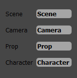
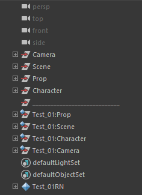
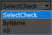
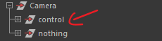
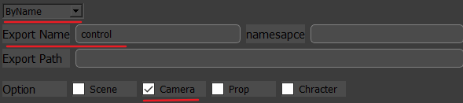

[TOC]

[Automation](# Automation)
[Export Alembic from Maya][# Export Alembic from Maya]
[Import Alembic from disk in Houdini][# Import Alembic from disk in Houdini]

# Automation

### **Status**

| System  | Houdini                                                      | Maya                                                         | Nuke                                                         |
| :-----: | :----------------------------------------------------------- | ------------------------------------------------------------ | ------------------------------------------------------------ |
| Windows |  |  |  |
|  Linux  |  |  |  |
|   Mac   |  |  |  |

### **Current Version**

* v0.1.0   - Beta
* v0.1.1  
  
  * 修复了在Houdini中使用此工具不能成功从Maya中导出Alembic的问题
* v0.1.2
  * 修复了一个bug，当第一次启动**Import Alembic**工具的时候，不能成功从磁盘导入Abc文件
  * 修改了Camera摄像机的命名, The old： Camera_arc1.abc --> **Camera**  The new: Camera_arc1.abc-->**Camera_arc1**
* v0.2.1
  * 整合ImportAlembic子工具到主页面板中，现在是一个按钮**ImportAlembic**
  * 修复了一个bug (导出时不检查所选择的文件类型，目前导出过滤文件**[.ma, .mb]**)
  * 移动**Dock**上的导出按钮与工具架上的设置按钮到主页面板底部
  * ImportAlembic子工具更新
    1. 增加返回上一层级按钮
    2. 增加鼠标双击事件(进入所选择的目录)
    3. 优化路径，(1)增加显示到LineEdit中. (2)当单击**Search**按钮时并且Path为空的时候默认显示Desktop目录.
    4. 修复了一个bug，(显示框重复显示)


## Export Alembic from Maya

### Config

* Standalone
  * Python2 + PySide2

* In Maya
  - 将install_maya.py文件到Maya窗口中，点击工具架图标

* In Houdini
  * 

### Explain

* 目前已知问题：

  ​		~~1.在导出文件时所选择的文件未作判断~~	【in v0.2.1 fixed】

  ​		2.不同分组的同一名称在导出时可能会覆盖

  ​		3.配置还不会被保存

  ​		4.顶级菜单功能还未实现

  ​		~~*5.测试在Maya与Nuke环境下可以正常导入， Houdini中失败*~~*-由于PYTHONHOME环境变量与Maya的PYTHONHOME环境变量冲突*~~	【【in v0.1.1 fixed】】

* 未来将要更新的内容：

  ​		1.场景优化（针对相机）

  ​		2.增加可视化大纲

  ​		2.导出时效率问题

### Use

1. 点击选择要导出的Maya文件的目录或者直接粘贴要导出的目录

2. 点击进行配置，默认FrameRange是根据Maya文件的设置

3. 命名默认与大纲对应，可更改

   ​                              大纲示例

4. 三种导出选项

* 根据所选择的类型（命名空间有则填无则空）
* 根据名称 （默认只搜索一级 例如则设置为
* 全部

5. 点击 Action 导出

## Import Alembic from disk in Houdini

### Config

* 打开Houdini.env
  * MYPATH = C:/Your/path
  * HOUDINI_PATH = "$MYPATH;&"

* 在Houdini中新建Tool

	```python
from automation.houdini import ImpoAbcFromDisk as iafd
reload(iafd)
iafd.run()
	```

### Use

* 指定Path之后按下Enter键选择要导入的abc文件(支持多选)
* 选择导出模式(Archive是带有节点树的，一般在导入相机选择这种模式)

[# Import Alembic from disk in Houdini]: 